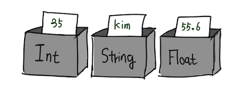
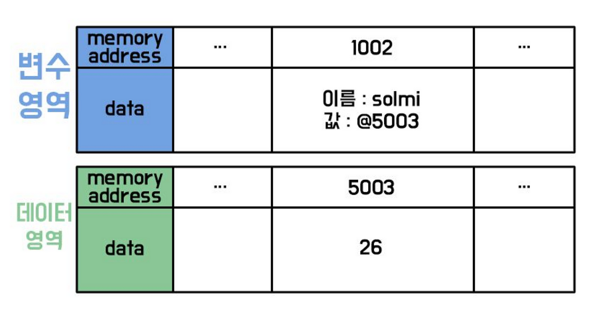

# **기본 문법과 코딩 규칙**
## 변수란?
변수는 데이터를 저장하고 참조할 수 있는 **메모리 공간의 이름**이다. 자바스크립트에서 변수는 키워드를 사용해 선언한다.



### **변수 선언 키워드의 종류**
1. **`var`**: 함수 스코프를 가지며, 호이스팅에 영향을 받는다.


2. **`let`**: 블록 스코프를 가지며, 재할당이 가능하다.


3. **`const`**: 블록 스코프를 가지며, 선언과 동시에 초기화해야 하고 재할당이 불가능하다.

## 자료형 
자바스크립트는 동적 타입 언어로, 변수의 자료형이 실행 중에 결정된다. 

### 원시 자료형 (Primitive Data Types)
원시 자료형(Primitive Data Type)은 프로그래밍 언어에서 가장 기본적인 데이터 유형으로, 더 이상 나눌 수 없는 단일 값을 가진다.
| 자료형     | 설명                          | 예시                           |
|------------|-------------------------------|--------------------------------|
| Number     | 숫자 데이터                   | 10, 3.14, -25                  |
| String     | 문자열 데이터                 | 'Hello', "World"              |
| Boolean    | 논리 데이터 (참/거짓)        | true, false                    |
| Null       | 값이 없음을 나타냄           | null                           |
| Undefined  | 변수가 선언되었으나 값이 없음 | let a; → a === undefined       |

```
"=" : 프로그램에서 "="는 대입 연산자라고 불린다.
이러한 대입 연산자는 좌 항의 값을 우항의 값으로 덮어씌우는 역할을 하게 된다.
num = 42 : 다음은 num이라는 변수에 42라는 값으로 덮어 씌우겠다는 의미이다.


let num = 42;          // Number
let str = "JavaScript"; // String
let isTrue = true;     // Boolean
let empty = null;      // Null
let notAssigned;       // Undefined
```
----------

## 동적 타입언어
자바스크립트는 var, let, const 키워드를 사용해 변수를 선언할 뿐 데이터 타입을 사전에 선언하지 않는다. <br>
즉, 동적 타입 언어는 변수 선언이 아닌 할당에 의해 타입이 결정(타입 추론)되며
재할당에 의해 변수의 타입은 언제든지 동적으로 변할 수 있다.<br>
변수의 값이 언제든지 변경 될 수 있기 때문에 값을 확인하기 전에는 타입을 확신할 수 없다.<br> 
개발자의 의도와 상관 없이 자바스크립트 엔진에 의해 암묵적으로 타입이 자동 변환되기도 한다.<br>
즉, 유연성은 높지만 신뢰성은 떨어진다.<br>
이로 인해 변수를 사용하기 전 데이터 타입 체크를 하기도 하는데 이는 번거롭기도 하고 코드의 양도 증가한다.

```
let test; 
// test 변수를 선언하였으나 값을 설정하지 않았으므로 빈 값을 의미하는 undefined 타입이 됨

test = 1; 
// 이전 시점에 test 변수는 undefined였으나, 이제 숫자 1이 할당됨으로써 test의 타입은 Number로 변경됨

test = "1"; // "" <- 문자열을 의미하며 "", '' 감싸진 값은 문자열로 취급이 된다.
// 이제 test 변수에 문자열 "1"가 할당됨으로써, test의 타입은 String으로 변경됨

test = true; 
// test 변수에 Boolean 값 true가 할당되면서, test의 타입은 Boolean으로 변경됨

test = null; 
// test 변수에 null이 할당되면서, test의 타입은 다시 null로 변경됨

test = { name: "Alice" }; 
// test 변수에 객체가 할당되면서, test의 타입은 Object로 변경됨

test = [1, 2, 3]; 
// test 변수에 배열이 할당되면서, test의 타입은 Array(객체의 한 종류)로 변경됨

```

-----

## 암묵적 형변환
암묵적 형변환은 자바스크립트 엔진이 필요에 따라 자동으로 데이터 타입을 변환하는 과정을 의미한다.<br> 
이는 코드의 간결함을 줄 수 있지만, 예상치 못한 결과를 초래할 수 있다.

- 예시: 숫자와 문자열을 함께 사용하면, 숫자가 문자열로 변환되어 결합된다.

### 형변환의 종류
1. 문자열 변환: 숫자 또는 불리언 값을 문자열로 변환
2. 숫자 변환: 문자열 또는 불리언 값을 숫자로 변환
3. 불리언 변환: 다양한 값들을 불리언으로 변환 (truthy와 falsy)

``` 
// 문자열과 숫자 결합
let num = 5;
let str = "10";
let result = num + str; // 결과: "510"
console.log(result); // "510"
```

```
// 문자열을 숫자로 변환

let strNum = "20";
let num = 5;
let result = strNum - num; // 결과: 15 (문자열이 숫자로 변환됨)
console.log(result); // 15
```

```
// 불리언과 숫자 결합

let bool = true; 
let num = 1;
let result = bool + num; // 결과: 2 (true는 1로 변환됨)
console.log(result); // 2
```

```
// 배열과 문자열 결합
let arr = [1, 2, 3];
let str = "Numbers: ";
let result = str + arr; // 결과: "Numbers: 1,2,3"
console.log(result); // "Numbers: 1,2,3"
```

####  주의사항
예상치 못한 결과: 암묵적 형변환은 코드의 가독성을 떨어뜨리고, 디버깅을 어렵게 만들 수 있다.<br>
best practice: 명시적 형변환(Explicit Type Conversion)을 사용하는 것이 좋다.
- 예를 들어, Number(), String(), Boolean() 함수를 사용하여 명확하게 형변환을 할 수 있다.<br>
이러한 방식을 명시적 형변환이라고 한다.


---
## 명시적 형변환
명시적 형변환(Explicit Type Conversion)은 프로그래머가 의도적으로 데이터 타입을 변환하는 과정을 말한다. 자바스크립트에서는 여러 방법으로 명시적 형변환을 수행할 수 있으며, 이는 코드의 가독성과 안정성을 높이는 데 도움이 된다.

- 예시: 문자열을 숫자로 변환하거나, 숫자를 문자열로 변환하는 경우.

### 형변환의 종류
1. 숫자로 변환: 문자열 또는 불리언 값을 숫자로 변환
2. 문자열로 변환: 숫자, 불리언, 객체 등을 문자열로 변환
3. 불리언으로 변환: 다양한 값들을 불리언으로 변환

```
// 불리언을 숫자로 변환
let bool = false;
let numFromBool = Number(bool); // 결과: 0
console.log(numFromBool); // 0
```

```
// 불리언을 숫자로 변환
let bool = false;
let numFromBool = Number(bool); // 결과: 0
console.log(numFromBool); // 0
```

```
// 객체를 문자열로 변환
let obj = { key: "value" };
let objStr = String(obj); // 결과: "[object Object]"
console.log(objStr); // "[object Object]"
```

```
// 배열을 문자열로 변환
let arr = [1, 2, 3];
let arrStr = arr.toString(); // 결과: "1,2,3"
console.log(arrStr); // "1,2,3"
```

#### 주의사항
예상치 못한 결과: 명시적 형변환을 사용하지 않으면, 원치 않는 타입 변환으로 인해 오류가 발생할 수 있다.<br>
best practice: 항상 명시적 형변환(Explicit Type Conversion)을 사용하여 데이터 타입을 명확히 변환하는 것이 좋다.

예를 들어, Number(), String(), Boolean() 함수를 사용하여 형변환을 수행할 수 있다.<br> 이러한 방식을 명시적 형변환이라고 한다.


-------------

## 자바스크립트 연산자

자바스크립트에서 연산자는 값을 조작하고 계산하는 데 사용된다. 

### 1. 산술 연산자 (Arithmetic Operators)
산술 연산자는 숫자 값을 계산하는 데 사용됩니다.

| 연산자 | 설명                        | 예시          |
|--------|----------------------------|---------------|
| `+`    | 덧셈                       | `5 + 3` → `8` |
| `-`    | 뺄셈                      | `5 - 3` → `2` |
| `*`    | 곱셈                       | `5 * 3` → `15`|
| `/`    | 나눗셈                     | `6 / 3` → `2` |
| `%`    | 나머지                     | `5 % 2` → `1` |
| `**`   | 거듭제곱                  | `2 ** 3` → `8`|

### 2. 대입 연산자 
대입 연산자는 변수에 값을 할당하는 데 사용된다.

| 연산자 | 설명                          | 예시                |
|--------|-------------------------------|---------------------|
| `=`    | 단순 대입                    | `a = 5`             |
| `+=`   | 덧셈 후 대입                 | `a += 3` → `a = a + 3` |
| `-=`   | 뺄셈 후 대입                 | `a -= 2` → `a = a - 2` |
| `*=`   | 곱셈 후 대입                 | `a *= 4` → `a = a * 4` |
| `/=`   | 나눗셈 후 대입               | `a /= 2` → `a = a / 2` |
| `%=`   | 나머지 후 대입               | `a %= 3` → `a = a % 3` |
| `**=`  | 거듭제곱 후 대입            | `a **= 2` → `a = a ** 2` |


### 2. 비교 연산자 (Comparison Operators)
비교 연산자는 두 값을 비교하고, 결과를 불리언 값(`true` 또는 `false`)으로 반환한다.

| 연산자 | 설명                        | 예시            |
|--------|----------------------------|-----------------|
| `==`   | 값이 같은지 비교           | `5 == '5'` → `true` |
| `===`  | 값과 타입이 같은지 비교    | `5 === '5'` → `false` |
| `!=`   | 값이 같지 않은지 비교      | `5 != '5'` → `false` |
| `!==`  | 값과 타입이 같지 않은지 비교| `5 !== '5'` → `true` |
| `>`    | 왼쪽 값이 오른쪽 값보다 큰지 비교 | `5 > 3` → `true` |
| `>=`   | 왼쪽 값이 오른쪽 값보다 크거나 같은지 비교 | `5 >= 5` → `true` |
| `<`    | 왼쪽 값이 오른쪽 값보다 작은지 비교 | `3 < 5` → `true` |
| `<=`   | 왼쪽 값이 오른쪽 값보다 작거나 같은지 비교 | `3 <= 3` → `true` |

### 3. 논리 연산자 (Logical Operators)
논리 연산자는 불리언 값을 조합하거나 반전하는 데 사용된다.

| 연산자 | 설명                        | 예시            |
|--------|----------------------------|-----------------|
| `&&`   | AND 연산 (둘 다 true일 때 true) | `true && false` → `false` |
| `||`   | OR 연산 (하나라도 true일 때 true) | `true || false` → `true` |
| `!`    | NOT 연산 (값을 반전)       | `!true` → `false` |

#### 결론
자바스크립트의 연산자는 다양한 방식으로 데이터를 처리하고 비교하는 데 필수적이다. 각 연산자의 기능을 잘 이해하면 더 복잡한 로직을 작성하는 데 도움이 된다.
