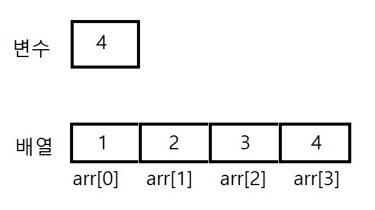

# 객체와 배열
## 1. 객체 (Object)
자바스크립트에서 객체는 키-값 쌍으로 구성된 데이터 구조이다. 객체는 다양한 데이터를 하나의 단위로 묶고, 각 데이터에 이름(키)을 통해 접근할 수 있게 해준다.


### 객체 생성
객체는 두 가지 방법으로 생성할 수 있다:

1. **객체 리터럴**:
   ```javascript
   const person = {
       name: '홍길동',
       age: 30,
       job: '개발자'
   };
    ```
2. **Object 생성자**:
    ```js
    const person = new Object();
    person.name = '홍길동';
    person.age = 30;
    person.job = '개발자';
    ```

### 객체의 속성 접근
객체의 속성에 접근하는 방법은 두 가지가 있다:

1. **점 표기법**:
    ```javascript
    console.log(person.name); // 홍길동
    ```
2. 대괄호 표기법:
    ```javascript
    console.log(person['age']); // 30
    ```

### 객체의 메서드
객체는 데이터뿐만 아니라 함수를 포함할 수 있으며, 이를 메서드라고 한다.
```javascript
const calculator = {
    add: function(a, b) {
        return a + b;
    }
};

console.log(calculator.add(5, 3)); // 8
```

----

## 2. 배열 (Array)
배열은 순서가 있는 데이터의 집합으로, 자바스크립트에서 배열은 객체의 특수한 형태이다. 배열은 다양한 타입의 데이터를 저장할 수 있으며, 배열의 각 요소는 인덱스를 통해 접근한다.



### 배열 생성
배열은 다음과 같이 생성할 수 있다:

1. 배열 리터럴:
    ```javascript
    const fruits = ['사과', '바나나', '체리'];
    ```

2. Array 생성자:
    ```js
    const fruits = new Array('사과', '바나나', '체리');
    ```

### 배열의 요소 접근
배열의 요소에 접근하려면 인덱스를 사용합니다. 인덱스는 0부터 시작한다.
```js 
console.log(fruits[0]); // 사과
```

1. push(): 배열의 끝에 요소 추가
    ```javascript
    fruits.push('딸기'); // ['사과', '바나나', '체리', '딸기']
    ```

2. pop(): 배열의 마지막 요소 제거 후 반환
    ```javascript
    fruits.pop(); // '딸기'가 제거됨
    ```

3. forEach(): 배열의 각 요소에 대해 함수를 실행
    ```javascript
    fruits.forEach(fruit => {
        console.log(fruit);
    });
    ```

3. map(): 배열의 각 요소를 변형한 새로운 배열 생성
    ```javascript
    const lengths = fruits.map(fruit => fruit.length);
    ```

#### 결론
자바스크립트에서 객체와 배열은 데이터를 구조화하고 관리하는 데 중요한 역할을 한다. 객체는 키-값 쌍으로 데이터를 저장하고, 배열은 순서가 있는 데이터의 집합이다. 


-------

## JSON
JSON(JavaScript Object Notation)은 데이터를 키-값 쌍으로 저장하는 경량 데이터 교환 형식이다. 자바스크립트 객체와 유사하며, 텍스트 기반이므로 가독성과 데이터 교환의 효율성이 높다. JSON은 웹 애플리케이션과 서버 간 데이터를 주고받는 데 자주 사용된다.

### 표현식
```json
{
    "name": "홍길동",
    "age": 30,
    "hobbies": ["독서", "등산", "코딩"]
}
```

### JSON과 자바스크립트 객체의 차이
1. 정의 및 형식 
    - 자바스크립트 객체: 자바스크립트의 데이터 구조로, 키-값 쌍으로 이루어져 있으며, 함수, 배열, 다른 객체 등을 포함할 수 있다.
        ```js
        const person = {
            name: "홍길동",
            age: 30,
            greet: function() {
                console.log("안녕하세요!");
            }
        };
        ```
    - JSON: 텍스트 기반의 데이터 형식으로, 데이터 전송 및 저장에 적합하다. JSON은 문자열 형태로 존재하며, 함수나 메서드를 포함할 수 없다.
        ```js
        {
            "name": "홍길동",
            "age": 30
        }
        ```

2. 사용 용도
    - 자바스크립트 객체: 주로 코드 내에서 데이터 구조를 정의하고 조작하는 데 사용된다. 객체는 프로그램의 상태를 유지하거나 기능을 구현하는 데 중요한 역할을 한다.
    - JSON: 클라이언트와 서버 간의 데이터 교환, API 응답, 파일 저장 등에 주로 사용된다.

3. 변환
    - 객체에서 JSON으로 변환: JSON.stringify() 메서드를 사용하여 자바스크립트 객체를 JSON 문자열로 변환할 수 있다.
    - JSON에서 객체로 변환: JSON.parse() 메서드를 사용하여 JSON 문자열을 자바스크립트 객체로 변환할 수 있다.


#### JSON 데이터 직렬화와 역직렬화
- 직렬화(JSON.stringify): 자바스크립트 객체를 JSON 문자열로 변환한다.
- 역직렬화(JSON.parse): JSON 문자열을 자바스크립트 객체로 변환한다.