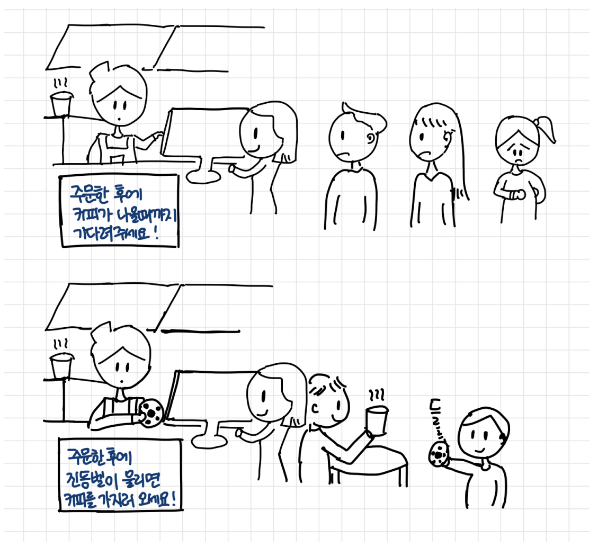

# 비동기 프로그램이란?
비동기 프로그램은 특정 작업이 완료될 때까지 기다리지 않고 다른 작업을 동시에 수행할 수 있도록 설계된 프로그램이다. 이 방식은 특히 I/O 작업(파일 읽기, 데이터베이스 쿼리, 네트워크 요청 등)에서 유용하며, 프로그램의 효율성과 반응성을 향상시키는 데 기여한다.



## 비동기 프로그래밍의 특징
1. **동시성 (Concurrency)**: 여러 작업이 동시에 진행될 수 있다. 비동기 프로그래밍은 작업이 완료될 때까지 대기하지 않고, 다른 작업을 수행할 수 있도록 한다.

2. **콜백 (Callback)**: 비동기 작업이 완료되면 호출되는 함수를 정의할 수 있다. 이 함수를 콜백이라고 하며, 작업이 끝난 후 결과를 처리하는 데 사용된다.

3. **프라미스 (Promise)**: 비동기 작업의 완료를 나타내는 객체이다. 프라미스는 비동기 작업이 성공했을 경우와 실패했을 경우를 처리할 수 있는 메서드를 제공한다.

4. **async/await**: ES2017(ES8)에서 도입된 구문으로, 비동기 코드를 동기 코드처럼 작성할 수 있게 해준다. 이를 통해 가독성을 높이고, 복잡한 콜백 구조를 피할 수 있다.

## 비동기 프로그래밍의 장점

1. **효율적인 자원 사용**: 비동기 프로그래밍을 통해 CPU와 I/O 자원을 효율적으로 사용할 수 있다. 대기 시간이 발생하는 동안 다른 작업을 수행할 수 있어, 프로그램의 전반적인 성능을 향상시킨다.

2. **반응성 향상**: 사용자 인터페이스와 같은 환경에서 비동기 처리는 프로그램의 반응성을 높여준다. 사용자가 인터페이스를 사용하면서도 데이터 로딩 등의 작업이 백그라운드에서 진행될 수 있다.

3. **확장성**: 서버와 같은 시스템에서 높은 동시성을 제공하여, 더 많은 요청을 동시에 처리할 수 있게 해준다.

## 비동기 프로그래밍의 예시

### 콜백 사용 예
```javascript
function fetchData(callback) {
    setTimeout(() => {
        const data = { id: 1, name: '홍길동' };
        callback(data);
    }, 1000); // 1초 후에 데이터 반환
}

fetchData((result) => {
    console.log('데이터:', result);
});
```

### 프라미스 사용 예
```javascript
function fetchData() {
    return new Promise((resolve, reject) => {
        setTimeout(() => {
            const data = { id: 1, name: '홍길동' };
            resolve(data);
        }, 1000);
    });
}

fetchData().then(result => {
    console.log('데이터:', result);
});
```


### async/await 사용 예
```javascript
async function fetchData() {
    return new Promise((resolve) => {
        setTimeout(() => {
            const data = { id: 1, name: '홍길동' };
            resolve(data);
        }, 1000);
    });
}

async function getData() {
    const result = await fetchData();
    console.log('데이터:', result);
}

getData();
```

#### 결론
비동기 프로그램은 현대 웹 애플리케이션과 서버 개발에서 필수적인 개념이다.<br> 비동기적으로 작업을 처리함으로써, 프로그램의 효율성과 반응성을 높이고, 사용자 경험을 개선할 수 있다.


----

## 동기와 비동기의 차이
- **동기(Synchronous)**: 작업이 순차적으로 실행된다. 한 작업이 끝나야 다음 작업이 시작된다.
- **비동기(Asynchronous)**: 작업이 병렬적으로 실행될 수 있다. 현재 작업이 완료되기 전에 다음 작업을 시작할 수 있다.

### 표현식
```js
// 동기 처리
console.log("A 작업 시작");
console.log("B 작업 시작");
console.log("C 작업 시작");

// 결과 A => B => C 

// 비동기 처리
console.log("A 작업 시작");
setTimeout(() => console.log("B 작업 완료"), 1000); // 1초 후 실행
console.log("C 작업 시작");

// 결과 A => C => B
```

## 이벤트 루프의 간단한 구조
이벤트 루프(Event Loop)는 비동기 작업을 처리하기 위한 메커니즘이다. <br> 자바스크립트는 싱글 스레드이지만 이벤트 루프를 사용해 비동기 작업을 효율적으로 처리한다.


### 주요 구성 요소
1. 콜 스택(Call Stack): 함수 실행 컨텍스트를 저장한다.
2. 이벤트 큐(Event Queue): 비동기 작업이 완료되면 실행 대기 중인 콜백 함수를 저장한다.

3. 이벤트 루프(Event Loop): 콜 스택이 비어 있으면 이벤트 큐에서 콜백을 가져와 실행한다.
    - 매크로 테스크 (Macro Task)<br>
        매크로 테스크는 타이머, 네트워크 요청, I/O 작업 등과 같은 비동기 작업이 완료되었을 때 실행되는 작업이다. 
    - 마이크로 테스크 (Micro Task) <br>
        마이크로 테스크는 프로미스의 .then(), .catch(), .finally()와 같은 비동기 작업의 결과를 처리하는 작업이다.
    - 마이크로 테스크는 매크로 테스크보다 우선적으로 실행된다. <br>
    즉, 현재 호출 스택이 비어지면, 이벤트 루프는 먼저 마이크로 테스크 큐를 확인하고, 모든 마이크로 테스크가 완료된 후에야 매크로 테스크 큐에서 작업을 실행한다.

```js
console.log("작업 시작"); // 콜 스택
setTimeout(() => console.log("비동기 작업 완료"), 1000); // 이벤트 큐로 이동
console.log("다른 작업 수행"); // 콜 스택
```


----

## `setTimeout`과 `setInterval`의 동작 원리
- **`setTimeout`**: 지정된 시간(ms) 후에 한 번 실행되는 함수이다.
- **`setInterval`**: 지정된 시간(ms) 간격으로 반복 실행되는 함수이다.
- 타이머 함수는 비동기적으로 실행되며, 이벤트 루프와 밀접한 관계가 있다.

### 표현식
```js
// setTimeout 사용 예
setTimeout(() => {
    console.log("1초 후에 실행");
}, 1000);

// setInterval 사용 예
let count = 0;
const intervalId = setInterval(() => {
    console.log(`Interval 실행: ${++count}`);
    if (count === 5) clearInterval(intervalId); // 5회 실행 후 종료
}, 1000);
```